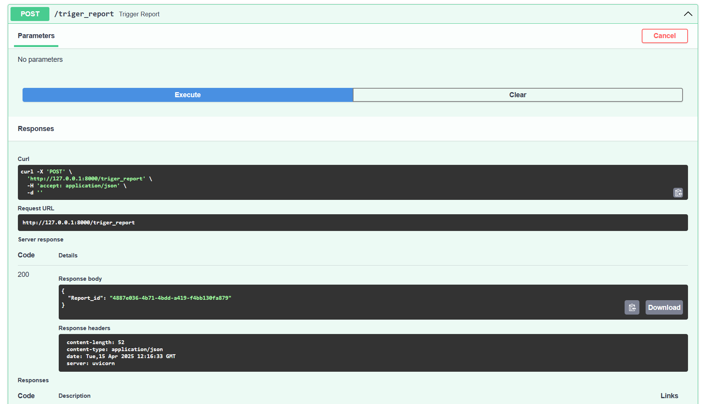
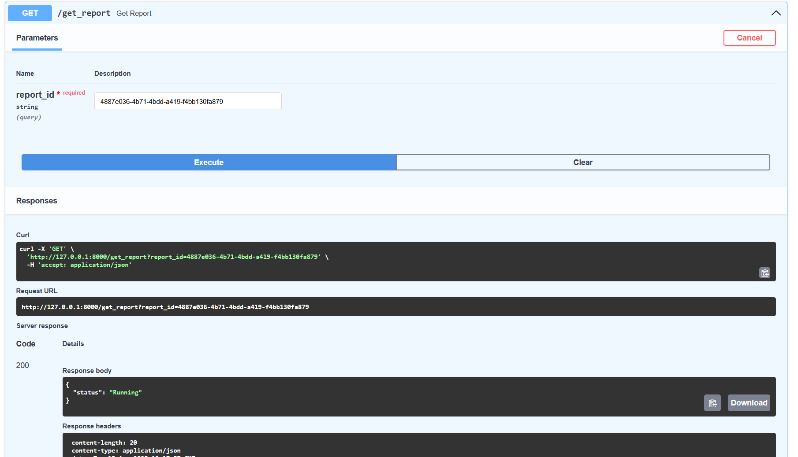
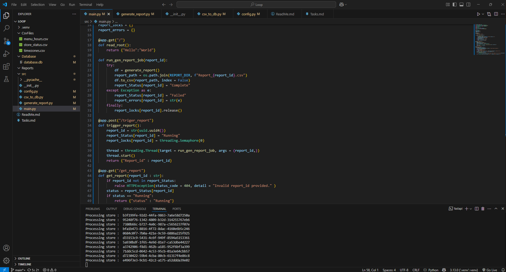
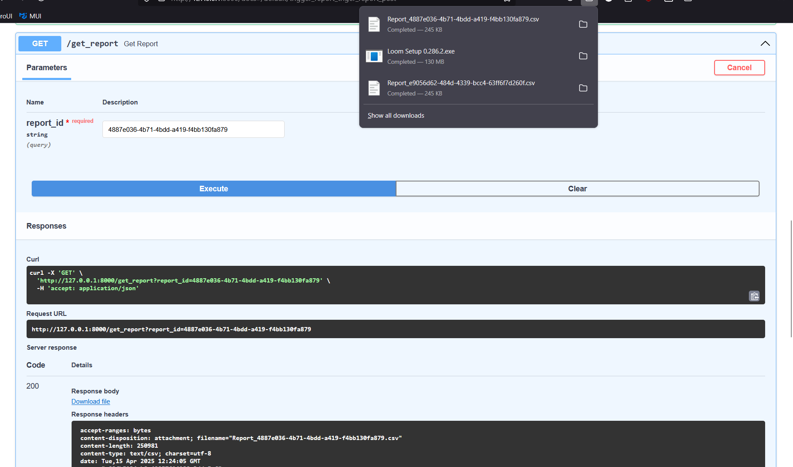

# LOOP-Interview-1

## Setup Instructions

### Required Files

To run the project successfully, please follow these steps:

1. **CSV Files:**
   + Place the required CSV files into the `CsvFolder` directory.

   + **Important:** The currently provided `timezones.csv` is a placeholder. Please **remove it** and replace it with the **updated three CSV files** as required.

2. **Database Placeholder:**
   + Ignore the `db_file_here.txt` file. It exists only to showcase the `Database` directory structure.

   + The actual `database.db` and large CSV files were not included in the commit due to size limitations.

---

## Workflow

### Step 1: Load CSV to Database

To load or update the database tables with new CSV data:

```bash
python csv_to_db.py
```
This script will:
+ Read from the CsvFolder directory.

+ Convert all CSVs to valid tables inside the SQLite database.

+ Additionally, it will process and convert menu_hours to UTC using the timezone table and store the result in a new table called utc_menu_hours.

### Step 2: Generate Report via Script
To generate the report manually run:
```bash
python generate_report.py
```


+ This script computes and outputs the report using the latest available data.

+ Note: The current timestamp is assumed to be the maximum timestamp available in the store_status table.


## API Usage
## Step 1: Run FastAPI Server
```bash
fastapi dev main.py
```
## Step 2: Access API Documentation
Once the server is running, visit:
```
http://127.0.0.1:8000/docs
```
This opens the interactive API documentation (Swagger UI).

## Step 3: Trigger report generation

+ Use the /trigger_report endpoint to initiate report generation.

+ The response will contain a report ID.

## Step 4: Fetch Report

+ Use the /get_report endpoint.

+ Required Parameter: report_id (from the previous step)

+ If the report is being generated, it will return 'running' orelse will return the file and 'complete'


## Screenshots





## Code Explanation
### main.py
Global variables
+ report_Status -> A dictionary to monitor the status[value] for a particular report_id[key].

+ report_locks -> A dictionary to store the lock states[value] for a particula report_id[key].

+ report_errors -> A dictionary to store the error[value] for a particular report_id[key].

Here the main api functions are 
+ read_root() -> It is just a simple hello world api call.

+ run_gen_report_job(report_id) -> It is a simple helper function to run the generate_report function, write its output to a csv file and set the report_status to 'complete' or 'failed'.

+ trigger_report() -> In this function a report_id is generated with the help of the uuid lib of python, the report_Status, and the report_locks is set for the newly generated report_id. It launches the run_gen_report(report_id) as a separate thread, and returns the report_id.

+ get_report(report_id) -> It checks the status of the provided report_id and if is 'running' it returns that. In the case it is 'complete', it gets the report from the Reports folder and sends over api using fastapi FileResponse

### csv_to_db.py
Here the main functions are
+ csv_to_database(csv_file, table_name) -> This function takes in the csv_file and the table_name, and writes it to the database using pandas dataframe.to_sql() method

+ convert_menu_hours() -> This function reads from the database and creates a menu_hours dataframe. With the help of the timezones_df, this function converts the local_start and local_end times to their respective UTC format, by utilizing datetime and pytz. It stores the converted data as a separate table in the backend called utc_menu_hours.

+ update_database() -> This is just a simple function that calls the csv_to_database() with the respective table names and csv file paths. It also converts the menu_hours to utc_menu_hours.

### generate_report.py
Here the main functions are
+ calculcate_interval_status(store_polls, start_time_Str, end_time_str) -> 
    + This function finds all the polls between the timestamps and sorts them. It also calculates the total_mins between the two polls. 
    + If there are no polls the returns 0.0 and total_mins as the uptime and downtime respectively. 
    + If the first polls' timestamp is greater than the start_timestamp, then we find the status of the start_timestamp by considering the previous poll to the first poll and use its status as the start_timestamp status or by default 'inactive'.This is added to the polls dataframe.
    + If the last polls' timestamp is lesser than the end_timestamp, then we find the status of the end_timestamp by considering the next poll to the last poll and use its status as the end_timestamp status or by default 'inactive'.This is added to the polls dataframe.
    + After this, a loop is run over all the polls, a time delta is calculated by finding the time diff between the current and the next poll timestamps.
    + If the status of the poll is 'active' then it is added to uptime_mins orelse downtime_mins. Both uptime_mins and downtime_mins are returned.

+ calculate_interval(menu_df, start_time_Str, end_time_str, store_polls) -> 
    + This function is for aggregating the uptime and downtime over the time range. 
    + It creates and loops over the date_Range, formed by extracting the start and end dates and storing all the dates between them. 
    + In the loop, the day_of_week is calculated using datetime.weekday() method. With this information a start_interval and end_interval is created.
    + If the end_interval is lesser than the start_interval, then the end_interval is pushed by one day.
    + If both the interval times lie between the start and end times, then it finds an effective start by finding the max of the two starts, and an effective end by finding the min of the two ends.
    + If the effective_start is less than the effective_end then it calculates the uptime and downtime using the above function and adds it to the total_uptime and total_downtime.
    + The function returns total_uptime and total_downtime
+ generate_report() ->
    + This is the main function to start the report generation process.
    + It reads the store_status and the utc_menu_hours table from the database and store it in dataframes.
    + It sets the current time stamp to the max time stamp in the store_status_df.
    + It also creates timestamps for one hour, one day and one week ago using datetime and timedelta wrt current_timestamp.
    + The function loops ove all unique store_ids, and gets polls for a singular store_id, and the menu_hours for the same store_id.
        + If the menu_hours is empty, we then assume the store to be functioning 24/7, so we directly call calculate_interval_status().
        + Else we call calculate_intervals() on them.
    + Once all the uptime_last_hour, downtime_last_hour, uptime_last_day, downtime_last_day, uptime_last_week, downtime_last_week is found it is stored in a list as a dictionary.
    + This dictionary is later converted into a dataframe called the report_df and returned.
